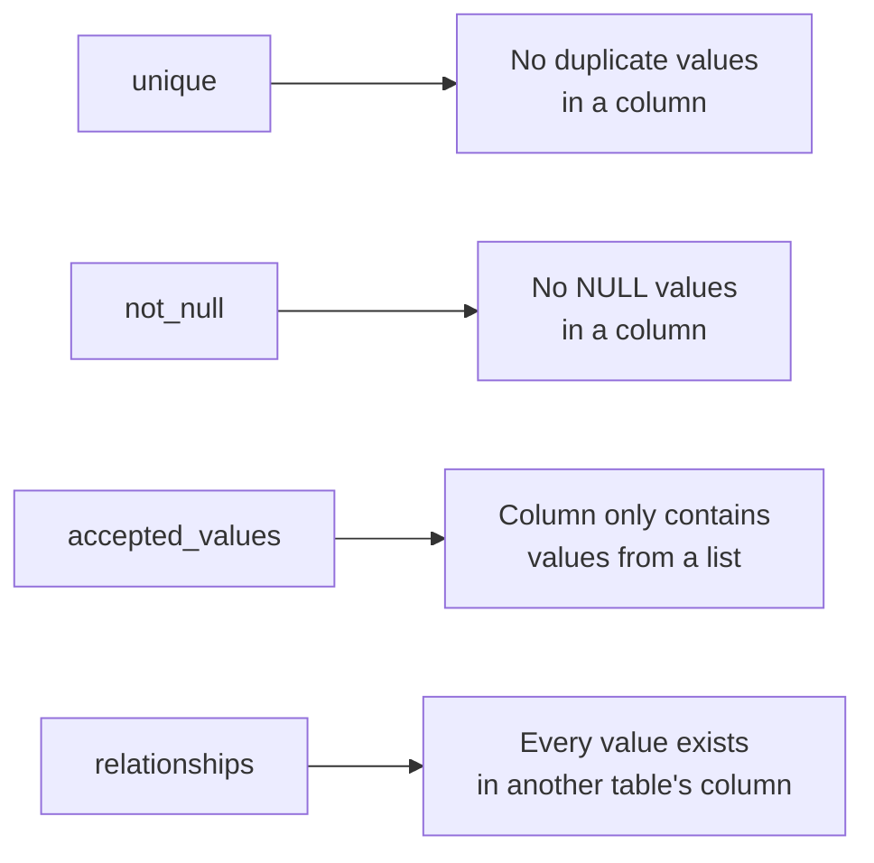
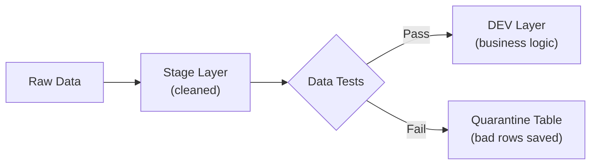

# Week 3: Data Tests

Welcome to Week 3 of the DataOps & dbt Mentorship Program! This week, we'll learn how to **validate your data** using dbt's built-in testing framework — catching bad data before it reaches dashboards.

---

## ✅ Prerequisites

Before starting Week 3, make sure you have completed **all of Week 2**:

- [ ] `docs/materializations.md` written
- [ ] `fct_order_details.sql` converted to incremental model
- [ ] `snapshots/snap_products.sql` created and working
- [ ] Snapshot simulation exercise completed

> **If your Week 2 models are not working yet, fix them first.** Week 3 builds directly on top of them.

---

## 📖 Lesson Overview

### Why Test Your Data?

Imagine a dashboard shows revenue doubled overnight — is it real growth or a bug? Without tests, you can't tell. **Data tests** are automated checks that validate your data every time dbt runs. They catch issues like:

- Duplicate IDs that inflate counts
- Missing values that break joins
- Invalid values (negative prices, future dates)
- Orphan records that reference non-existent parents

### Two Types of dbt Tests

| Type               | Where It Lives       | How It Works                                                              |
| ------------------ | -------------------- | ------------------------------------------------------------------------- |
| **Generic Tests**  | `schema.yml` (YAML) | Pre-built checks:`unique`, `not_null`, `accepted_values`, `relationships` |
| **Singular Tests** | `tests/*.sql`        | Custom SQL queries — if the query returns**any rows**, the test **fails** |

### Generic Tests: The Big Four

dbt comes with 4 built-in generic tests:



**Example in YAML:**

```yaml
models:
  - name: stg_orders
    columns:
      - name: order_id
        tests:
          - unique
          - not_null
      - name: order_status
        tests:
          - accepted_values:
              values:
                ["completed", "pending", "shipped", "returned", "cancelled"]
```

### Singular Tests: Custom SQL Checks

A singular test is just a SQL `SELECT` query saved in the `tests/` folder. **If the query returns any rows, the test fails.** Think of it as: "find me the bad rows."

**Example:**

```sql
-- tests/test_no_future_orders.sql
-- This test FAILS if any orders have a date in the future

select *
from {{ ref('stg_orders') }}
where order_date > current_date
```

> **Key concept:** The test query should return the _failing_ rows. An empty result = test passes. Any rows returned = test fails.

### What is a Quarantine Table?

Instead of just failing tests and forgetting about it, we can **capture the bad rows** into a special "quarantine" table. This is a dbt model that SELECTs all rows that violate our business rules, so we can investigate and fix them.



---

## 📝 Assignment Tasks

### Task 3.1 — Generic Tests in YAML (30 pts)

Create a schema file at `models/stage/schema.yml` that defines generic tests for all your staging models.

**What you need to do:**

1. Create the `schema.yml` file
2. List each staging model under the `models:` key
3. Add the required tests to the appropriate columns

**Required tests per model:**

| Model                 | Column          | Required Tests                                                                     |
| --------------------- | --------------- | ---------------------------------------------------------------------------------- |
| `stg_customers`       | `customer_id`   | `unique`, `not_null`                                                               |
| `stg_customers`       | `email`         | `not_null`                                                                         |
| `stg_products`        | `product_id`    | `unique`, `not_null`                                                               |
| `stg_orders`          | `order_id`      | `unique`, `not_null`                                                               |
| `stg_orders`          | `customer_id`   | `not_null`                                                                         |
| `stg_orders`          | `order_status`  | `accepted_values` → `['completed', 'pending', 'shipped', 'returned', 'cancelled']` |
| `stg_order_items`     | `order_item_id` | `unique`, `not_null`                                                               |
| `stg_order_items`     | `order_id`      | `relationships` → to `stg_orders`                                                  |
| `stg_order_items`     | `product_id`    | `relationships` → to `stg_products`                                                |
| `stg_store_locations` | `store_id`      | `unique`, `not_null`                                                               |

**💡 Code Hints:**

Here's the general structure of `schema.yml`:

```yaml
version: 2

models:
  - name: stg_customers
    columns:
      - name: customer_id
        tests:
          - unique
          - not_null
      - name: email
        tests:
          - not_null

  - name: stg_products
    columns:
      - name: product_id
        tests:
          - unique
          - not_null

  # ... continue for the remaining models
```

A `relationships` test checks that every value in a column exists in another table. Here's the syntax:

```yaml
- name: order_id
  tests:
    - relationships:
        to: ref('stg_orders')
        field: order_id
```

An `accepted_values` test checks that a column only contains values from a predefined list:

```yaml
- name: order_status
  tests:
    - accepted_values:
        values: ["completed", "pending", "shipped", "returned", "cancelled"]
```

**Testing your work:**

```bash
# Run all tests
dbt test --profiles-dir .

# Run tests for a specific model
dbt test --select stg_orders --profiles-dir .
```

> **Important:** Some tests **SHOULD fail** — that's intentional! The seed data contains planted quality issues. Your job is to identify which tests fail and understand _why_.

**Deliverable:** `models/stage/schema.yml` and `dbt test` output.

| Criteria                                                    | Points |
| ----------------------------------------------------------- | ------ |
| All required generic tests are defined in YAML              | 10     |
| `dbt test` runs (some tests SHOULD fail — that's the point) | 5      |
| Student can identify and explain each failure               | 10     |
| Correct YAML syntax                                         | 5      |

---

### Task 3.2 — Custom Singular Tests (35 pts)

Write 5 custom SQL tests in the `tests/` directory. Each test should `SELECT` the rows that violate a business rule — if any rows are returned, the test fails.

**What you need to create:**

| Test File                       | What It Checks                                | Which Table       |
| ------------------------------- | --------------------------------------------- | ----------------- |
| `test_no_future_orders.sql`     | No `order_date > current_date`                | `stg_orders`      |
| `test_positive_quantities.sql`  | No `quantity <= 0`                            | `stg_order_items` |
| `test_valid_discount_range.sql` | No `discount_pct < 0` or `discount_pct > 100` | `stg_order_items` |
| `test_positive_shipping.sql`    | No `shipping_fee < 0`                         | `stg_orders`      |
| `test_positive_cost_price.sql`  | No `cost_price < 0`                           | `stg_products`    |

**💡 Code Hints:**

Each test file is a standalone SQL query. Use `{{ ref() }}` to reference your staged models (not raw tables):

```sql
-- tests/test_no_future_orders.sql
-- Fails if any order has a date in the future

select *
from {{ ref('stg_orders') }}
where order_date > current_date
```

```sql
-- tests/test_positive_quantities.sql
-- Fails if any order item has zero or negative quantity

select *
from {{ ref('stg_order_items') }}
where quantity <= 0
```

```sql
-- tests/test_valid_discount_range.sql
-- Fails if discount is outside the valid 0–100% range

select *
from {{ ref('stg_order_items') }}
where discount_pct < 0 or discount_pct > 100
```

Follow the same pattern for the remaining two tests.

**Testing your work:**

```bash
# Run all tests (generic + singular)
dbt test --profiles-dir .

# Run only singular tests
dbt test --select test_type:singular --profiles-dir .
```

> **Expect failures!** The seed data has intentional issues — negative prices, future dates, and more. Document what fails and why.

**Deliverable:** All 5 test files in `tests/` + `dbt test` output showing failures.

| Criteria                                              | Points |
| ----------------------------------------------------- | ------ |
| All 5 custom tests are created                        | 10     |
| Tests use `{{ ref() }}` to reference staged models    | 5      |
| Tests return failing rows correctly (SELECT bad rows) | 10     |
| Student documents which rows fail and why             | 10     |

---

### Task 3.3 — Quarantine Table (20 pts)

Create `models/dev/quarantine_orders.sql` — a model that captures all "bad" orders into a single table for investigation.

**What you need to do:**

1. Create the model file
2. Use `UNION ALL` to combine all order rows that fail any quality check
3. Add a `failure_reason` column so you know _why_ each row was flagged

**💡 Code Hints:**

The quarantine model should filter orders that violate any of these rules:

```sql
{{
    config(
        materialized='table'
    )
}}

with future_dates as (
    -- Orders with dates in the future
    select *, 'future_order_date' as failure_reason
    from {{ ref('stg_orders') }}
    where order_date > current_date
),

missing_customer as (
    -- Orders with no customer assigned
    select *, 'missing_customer_id' as failure_reason
    from {{ ref('stg_orders') }}
    where customer_id is null or trim(customer_id) = ''
),

negative_shipping as (
    -- Orders with negative shipping fees
    select *, 'negative_shipping_fee' as failure_reason
    from {{ ref('stg_orders') }}
    where shipping_fee < 0
),

bad_status as (
    -- Orders with unrecognized statuses
    select *, 'invalid_order_status' as failure_reason
    from {{ ref('stg_orders') }}
    where order_status not in ('completed', 'pending', 'shipped', 'returned', 'cancelled')
)

select * from future_dates
union all
select * from missing_customer
union all
select * from negative_shipping
union all
select * from bad_status
```

> **Key concept:** This is a real-world pattern! In production pipelines, quarantine tables let data engineers investigate issues without blocking the entire pipeline.

**Testing your work:**

```bash
# Build the quarantine model
dbt run --select quarantine_orders --profiles-dir .

# Check how many bad rows were captured
# (run this in your SQL client)
SELECT failure_reason, count(*) FROM "DEV"."quarantine_orders" GROUP BY 1;
```

**Deliverable:** A working `quarantine_orders.sql` model with clear filter logic.

| Criteria                                        | Points |
| ----------------------------------------------- | ------ |
| Model captures all known bad orders             | 10     |
| Clear comments explaining each filter condition | 5      |
| Model materializes as a table                   | 5      |

---

### Task 3.4 — Data Quality Report (15 pts)

Write a short summary document at `docs/data_quality_report.md` listing every data issue you found during testing.

**What to include:**

For each issue, document:

1. **Which table** the issue is in (e.g., `raw_orders`)
2. **Which row(s)** are affected (e.g., `order_id = 1201`)
3. **What the issue is** (e.g., "order_date is set to 2099-12-31 — a future date")
4. **Which test caught it** (e.g., `test_no_future_orders.sql`)
5. **Your recommended fix** (e.g., "filter out in staging" or "fix upstream in source system")

**💡 Suggested format:**

```markdown
# Data Quality Report

## Summary

Found X issues across Y tables during Week 3 testing.

## Issues Found

### 1. Future Order Date

- **Table:** raw_orders
- **Row:** order_id = 1201
- **Issue:** order_date is 2099-12-31 (future date)
- **Test:** test_no_future_orders.sql
- **Recommended Fix:** Filter out in staging layer

### 2. Duplicate Order ID

- **Table:** raw_orders
- **Row:** order_id = 1050 (appears twice)
- **Issue:** Duplicate primary key
- **Test:** unique test on order_id
- **Recommended Fix:** Deduplicate in staging using ROW_NUMBER()

... continue for all issues found
```

> **Goal:** You should find **at least 10** data quality issues across all the seed tables. The more you find, the better!

**Deliverable:** `docs/data_quality_report.md`

| Criteria                                                               | Points |
| ---------------------------------------------------------------------- | ------ |
| All issues documented (must find at least 10 of the 14 planted issues) | 10     |
| Reasonable fix recommendations                                         | 5      |

---

### Week 3 Total: **100 points**

---

## 🔧 dbt Commands Reference

```bash
# Run all models
dbt run --profiles-dir .

# Run a specific model
dbt run --select quarantine_orders --profiles-dir .

# Run ALL tests (generic + singular)
dbt test --profiles-dir .

# Run tests for a specific model
dbt test --select stg_orders --profiles-dir .

# Run only singular tests
dbt test --select test_type:singular --profiles-dir .

# Run only generic (schema) tests
dbt test --select test_type:generic --profiles-dir .

# Reload seed data
dbt seed --profiles-dir .

# Check your project compiles
dbt compile --profiles-dir .
```

---

## 📂 Expected File Structure After Week 3

```
dbt_learning/
├── models/
│   ├── stage/
│   │   ├── sources.yml
│   │   ├── schema.yml                ← NEW (generic tests)
│   │   ├── stg_customers.sql
│   │   ├── stg_products.sql
│   │   ├── stg_orders.sql
│   │   ├── stg_order_items.sql
│   │   └── stg_store_locations.sql
│   └── dev/
│       ├── fct_order_details.sql
│       ├── dim_customers.sql
│       └── quarantine_orders.sql      ← NEW
├── snapshots/
│   └── snap_products.sql
├── tests/
│   ├── test_no_future_orders.sql      ← NEW
│   ├── test_positive_quantities.sql   ← NEW
│   ├── test_valid_discount_range.sql  ← NEW
│   ├── test_positive_shipping.sql     ← NEW
│   └── test_positive_cost_price.sql   ← NEW
└── docs/
    ├── materializations.md
    └── data_quality_report.md         ← NEW
```

---

## 🤖 Auto-Grade Your Work

Once you've completed all tasks, run the grading script to check your progress:

```bash
python scripts/grade_assignment.py --week 3
```

The script will verify that your files exist, contain the correct patterns, and follow the assignment requirements. Fix any ❌ items and re-run until you're satisfied with your score.

Good luck! 🚀
