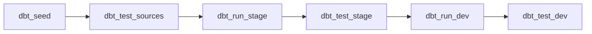

# Week 6: Airflow Automation

Welcome to the **final week** of the DataOps & dbt Mentorship Program! Until now you have run every dbt command by hand. This week you will hand that job to **Apache Airflow** — an orchestrator that runs your pipeline on a schedule, in the right order, with retries and failure alerts. By the end you will have a production-style DAG that seeds, tests, and builds your entire dbt project automatically.

---

## ✅ Prerequisites

Before starting Week 6, make sure your stack is healthy and your earlier work runs:

- [ ] `docker compose up -d` brings up `postgres` and the three `airflow-*` services
- [ ] `dbt run --profiles-dir .` succeeds locally (your Week 1–5 models build)
- [ ] `dbt test --profiles-dir .` runs (some tests may fail by design — that's fine)
- [ ] You can open the Airflow UI at **http://localhost:8080** (login `admin` / `admin`)

> **If your earlier weeks aren't building, fix them first.** The DAG simply runs the same dbt commands you already run by hand — if they fail in the terminal, they will fail in Airflow too.

---

## 🛠️ One-Time Setup: Put dbt *inside* Airflow

Here is the single most important concept of this week:

> **A `BashOperator` runs its command on the Airflow worker. So `dbt` must be installed *where the task runs* — inside the Airflow container — and the dbt project must be mounted there too.**

Stock `apache/airflow` has no dbt and can't see your `dbt_learning/` folder. We fix both with a custom image and a volume mount. **This is already wired up for you** in the repo — your job is to understand it and rebuild.

**1. `Dockerfile.airflow`** — Airflow + dbt in one image:

```dockerfile
FROM apache/airflow:2.10.5
USER airflow
RUN pip install --no-cache-dir dbt-postgres==1.9.*
```

**2. `docker-compose.yml`** — the shared `x-airflow-common` block now *builds* that image and *mounts* the dbt project:

```yaml
x-airflow-common: &airflow-common
  build:
    context: .
    dockerfile: Dockerfile.airflow
  image: dataops-airflow:2.10.5
  # ...
  volumes:
    - ./airflow/dags:/opt/airflow/dags
    - ./airflow/logs:/opt/airflow/logs
    - ./airflow/plugins:/opt/airflow/plugins
    - ./dbt_learning:/opt/airflow/dbt        # ← your dbt project, visible to tasks
```

**3. Build and start** the dbt-enabled Airflow image:

```bash
docker compose build
docker compose up -d
```

**4. Verify dbt is reachable from inside Airflow:**

```bash
docker compose exec airflow-scheduler bash -lc "cd /opt/airflow/dbt && dbt debug --profiles-dir ."
```

You should see `Connection test: OK`. dbt connects to the `postgres` service automatically because docker-compose injects `POSTGRES_HOST=postgres` (and friends) from `.env`, and your `profiles.yml` reads them with `env_var(...)`.

> **Why not `docker compose run dbt ...` inside the DAG?** That would be "Docker-in-Docker" — the Airflow container would need the Docker socket and CLI. Installing dbt directly in the Airflow image is simpler, more reliable (especially on Windows/Docker Desktop), and closer to how teams actually run dbt under Airflow.

---

## 📖 Lesson Overview

### What is Airflow?

**Apache Airflow** is a workflow orchestrator. You describe your pipeline as code (a Python file), and Airflow handles **scheduling**, **ordering**, **retries**, **logging**, and a **web UI** to watch it all.

### What is a DAG?

A **DAG** (Directed Acyclic Graph) is one workflow. It's a set of **tasks** connected by **dependencies** that flow one way and never loop. Our DAG runs the dbt pipeline as a straight line:



Each box is a **task**; each arrow is a **dependency**. `dbt_run_stage` won't start until `dbt_test_sources` succeeds — so we never build the staging layer on top of un-loaded or broken raw data.

### Operators: Bash vs Python

An **operator** is a template for one task.

| Operator | Runs | Use it when… |
| --- | --- | --- |
| `BashOperator` | A shell command | Calling a CLI — like `dbt run`. Task passes if the command exits `0`. |
| `PythonOperator` | A Python function | The logic is Python — an API call, a branch, a custom notification. |

Every task here is a `BashOperator` because the work is done by the `dbt` CLI.

### Scheduling

`schedule` (older Airflow called it `schedule_interval`) controls how often the DAG runs — a cron string like `"0 6 * * *"` (daily 06:00), a preset like `"@daily"`, or a `timedelta`. Airflow evaluates cron in **UTC**. `catchup=False` stops Airflow from back-filling every interval since `start_date` the moment you enable the DAG.

### Callbacks (error handling)

A DAG or task can define an `on_failure_callback` — a Python function Airflow calls **when a task fails**, passing it the run **context** (`task_instance`, the exception, etc.). Use it to alert a human: write a log line, post to Slack, send an email, page on-call.

---

## 📝 Assignment Tasks

### Task 6.1 — Airflow Concepts (10 pts)

Write `docs/airflow_overview.md` answering, **in your own words**:

1. What is a DAG?
2. What is the difference between a `BashOperator` and a `PythonOperator`?
3. What does the `schedule_interval` parameter control?
4. What is a sensor and when would you use one?

**Testing your work:** just confirm the file exists and each question is answered with a real explanation (not one line).

**Deliverable:** `dbt_learning/docs/airflow_overview.md`

| Criteria | Points |
| --- | --- |
| All 4 questions answered correctly | 8 |
| Answers are in the student's own words | 2 |

---

### Task 6.2 — Build the Pipeline DAG (45 pts)

Create `airflow/dags/dbt_pipeline.py` with this linear task flow:

```
dbt_seed → dbt_test_sources → dbt_run_stage → dbt_test_stage → dbt_run_dev → dbt_test_dev
```

**Requirements:**
- Use `BashOperator` to run dbt commands (dbt runs inside the Airflow image — see setup above).
- Schedule daily at **06:00 UTC**.
- `catchup=False`.
- `retries=2` and `retry_delay=5 minutes`.
- `default_args` with `owner` set to **your name**.

**💡 Code Hints:**

```python
from datetime import datetime, timedelta

from airflow import DAG
from airflow.operators.bash import BashOperator

# docker-compose mounts ./dbt_learning here inside the Airflow containers
DBT_DIR = "/opt/airflow/dbt"

default_args = {
    "owner": "student_name",          # ← your name
    "depends_on_past": False,
    "retries": 2,
    "retry_delay": timedelta(minutes=5),
}

def dbt_task(dag, task_id, dbt_command):
    return BashOperator(
        task_id=task_id,
        bash_command=f"cd {DBT_DIR} && dbt {dbt_command} --profiles-dir . --target dev",
        dag=dag,
    )

with DAG(
    dag_id="dbt_pipeline",
    default_args=default_args,
    start_date=datetime(2024, 1, 1),
    schedule="0 6 * * *",             # daily 06:00 UTC
    catchup=False,
    tags=["dbt", "dataops"],
) as dag:

    dbt_seed         = dbt_task(dag, "dbt_seed",         "seed")
    dbt_test_sources = dbt_task(dag, "dbt_test_sources", 'test --select "source:*"')
    dbt_run_stage    = dbt_task(dag, "dbt_run_stage",    "run --select stage")
    dbt_test_stage   = dbt_task(dag, "dbt_test_stage",   "test --select stage")
    dbt_run_dev      = dbt_task(dag, "dbt_run_dev",      "run --select dev")
    dbt_test_dev     = dbt_task(dag, "dbt_test_dev",     "test --select dev")

    (
        dbt_seed
        >> dbt_test_sources
        >> dbt_run_stage
        >> dbt_test_stage
        >> dbt_run_dev
        >> dbt_test_dev
    )
```

> **How does stage vs dev selection work?** dbt lets you select by folder: `--select stage` runs every model in `models/stage/`, `--select dev` runs `models/dev/`. `--select "source:*"` runs tests defined on your sources.

**Testing your work:**

```bash
# 1. After editing the DAG, re-import is automatic, but check for errors:
docker compose exec airflow-scheduler airflow dags list-import-errors      # expect: None
docker compose exec airflow-scheduler airflow dags list | grep dbt_pipeline

# 2. Dry-run individual tasks (no scheduler needed):
docker compose exec airflow-scheduler airflow tasks test dbt_pipeline dbt_seed 2024-01-01
docker compose exec airflow-scheduler airflow tasks test dbt_pipeline dbt_run_stage 2024-01-01
```

**Deliverable:** `airflow/dags/dbt_pipeline.py`

| Criteria | Points |
| --- | --- |
| DAG has correct task dependencies (linear chain) | 10 |
| Uses `BashOperator` with correct dbt commands | 10 |
| Schedule is set to daily 6 AM UTC | 5 |
| `catchup=False` is set | 3 |
| `retries` and `retry_delay` configured | 5 |
| `default_args` properly defined | 2 |
| DAG appears in Airflow UI without import errors | 10 |

---

### Task 6.3 — Trigger a Manual Run (20 pts)

1. Open the Airflow UI at **http://localhost:8080** (`admin` / `admin`).
2. Find `dbt_pipeline`, un-pause it (toggle on the left), then click **▶ Trigger DAG**.
3. Wait for it to finish — every task should turn **dark green** (success).
4. Take two screenshots and save them in `week_6/`:
   - The **Graph view** with all six tasks green.
   - The **log output** of the `dbt_run_dev` task (click the task → **Logs**).

**💡 Tip:** click a task square → **Logs** to see the actual dbt output, exactly as if you ran it in your terminal.

**Deliverable:** two screenshots in `week_6/` (e.g. `screenshot_graph.png`, `screenshot_dbt_run_dev_log.png`).

| Criteria | Points |
| --- | --- |
| DAG triggered successfully | 5 |
| All tasks pass (green) | 10 |
| Log screenshot shows dbt output | 5 |

---

### Task 6.4 — Error Handling: Failure Notification (15 pts)

Add an `on_failure_callback` to the DAG that fires when any task fails. It must **use the Airflow context** and either log the failure details or send a notification.

**💡 Code Hints:**

```python
FAILURE_LOG = "/opt/airflow/logs/dbt_pipeline_failures.log"

def notify_failure(context):
    ti = context["task_instance"]
    msg = (
        f"FAILED  dag={ti.dag_id}  task={ti.task_id}  "
        f"try={ti.try_number}  exception={context.get('exception')}\n"
    )
    with open(FAILURE_LOG, "a", encoding="utf-8") as fh:
        fh.write(msg)

# Attach it so every task uses it:
default_args = {
    "owner": "student_name",
    "retries": 2,
    "retry_delay": timedelta(minutes=5),
    "on_failure_callback": notify_failure,
}
```

> In production you'd replace the file write with a Slack webhook, email, or PagerDuty call — but the **shape** is the same: a function that receives `context` and reacts to the failure.

**Testing your work — break something on purpose:**

> ⚠️ **Two gotchas that trip everyone up:**
> 1. **`airflow tasks test` does NOT run callbacks.** It executes the task in isolation and skips the failure-callback machinery entirely. You must run a *real* DAG run (`airflow dags test ...` or trigger it in the UI).
> 2. **The callback fires only on a task's _final_ failure — after all retries are exhausted.** With `retries=2` + `retry_delay=5min`, a broken task takes ~10 minutes and 3 attempts before the callback runs. To see it fire **immediately** while testing, temporarily set `retries=0`, then put it back to `2` when you're done.

```bash
# 1. Temporarily set retries=0 in default_args (so the callback fires on the
#    first failure instead of after 10 minutes of retries).
# 2. Introduce a SQL error into a stage model — e.g. change the final line of
#    models/stage/example_stg_orders.sql to:
#        select * from cleaned_does_not_exist
# 3. Run the WHOLE dag synchronously (this path DOES run callbacks):
docker compose exec airflow-scheduler airflow dags test dbt_pipeline 2024-01-01

# 4. Confirm the callback wrote a record:
docker compose exec airflow-scheduler cat /opt/airflow/logs/dbt_pipeline_failures.log
```

**Remember to undo your intentional break and restore `retries=2`** so the pipeline is green again.

**Deliverable:** updated `dbt_pipeline.py` with the callback, plus proof it fired (the log line, in a screenshot or in `week_6/`).

| Criteria | Points |
| --- | --- |
| Callback function is defined and referenced | 5 |
| Callback receives and uses the Airflow context (`context['task_instance']`) | 5 |
| Callback tested by intentionally breaking a dbt model and showing the output | 5 |

---

### Task 6.5 — Reflection Document (10 pts)

Write `docs/pipeline_retrospective.md` answering:

1. What would you change about the pipeline if this were production?
2. What additional monitoring would you add?
3. What was the hardest part of the entire 6-week program?

**Deliverable:** `dbt_learning/docs/pipeline_retrospective.md`

| Criteria | Points |
| --- | --- |
| Thoughtful answers showing understanding | 7 |
| At least one specific improvement idea | 3 |

---

### Week 6 Total: **100 points**

---

## 🔧 Commands Reference

```bash
# Build the dbt-enabled Airflow image and start the whole stack
docker compose build
docker compose up -d

# Confirm dbt works inside Airflow
docker compose exec airflow-scheduler bash -lc "cd /opt/airflow/dbt && dbt debug --profiles-dir ."

# DAG health
docker compose exec airflow-scheduler airflow dags list-import-errors
docker compose exec airflow-scheduler airflow dags list

# Dry-run a single task (no scheduler / no DAG run needed)
docker compose exec airflow-scheduler airflow tasks test dbt_pipeline dbt_seed 2024-01-01

# Trigger the whole DAG from the CLI (or use the UI ▶ button)
docker compose exec airflow-scheduler airflow dags trigger dbt_pipeline

# Tail Airflow logs / open the UI
#   UI:  http://localhost:8080   (admin / admin)
```

---

## 📂 Expected File Structure After Week 6

```
DataOps-dbt/
├── Dockerfile.airflow                 ← NEW (Airflow + dbt-postgres)
├── docker-compose.yml                 ← UPDATED (build airflow image + mount dbt project)
├── airflow/
│   └── dags/
│       └── dbt_pipeline.py            ← NEW (the orchestration DAG)
├── dbt_learning/
│   └── docs/
│       ├── airflow_overview.md        ← NEW (Task 6.1)
│       └── pipeline_retrospective.md  ← NEW (Task 6.5)
└── week_6/
    ├── README.md
    ├── screenshot_graph.png           ← Task 6.3
    └── screenshot_dbt_run_dev_log.png ← Task 6.3
```

---

## 🤖 Auto-Grade Your Work

Once you have completed all tasks, run the grading script:

```bash
python scripts/grade_assignment.py --week 6
```

The script verifies your DAG, infra, and docs contain the required patterns. Task 6.3 (screenshots) is checked by looking for image files in `week_6/`. Fix any ❌ items and re-run until you're satisfied with your score.

🎉 **Congratulations on reaching the end of the program!** 🚀
